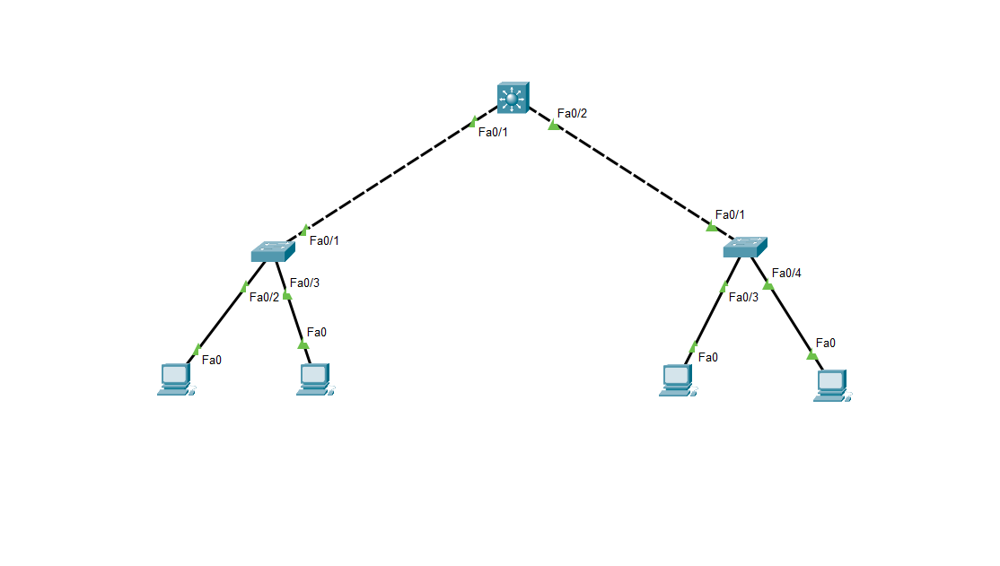

# Dhcp Using Switch

## 🖼️ Network Topology


## 📄 Overview
This deployment provides Layer 2 network segmentation and DHCP services for client devices.

## 🎯 Project Objective
Implement network segmentation using VLANs to isolate broadcast domains and centralize IP address management for client subnets.

## 💡 Skills Demonstrated
- VLAN Configuration
- 802.1Q Trunking
- DHCP Services

## 🛠️ Core Capabilities
- VLANs
- 802.1Q
- DHCP

## 📊 Addressing Matrix

| Device / Interface | IP Address | VLAN / Role |
|-------------------|-----------|------------|
| Switch: Fa0/1 | N/A | Trunk (VLAN 1,10,20) |
| Switch: Fa0/2 | N/A | Trunk (VLAN 1,10,20) |
| Switch: Fa0/3-24, Gig0/1-2 | N/A | Access (VLAN 1) |
| DHCP Pool (VLAN 10) | 192.168.10.0/24 (Clients) | DHCP Server |
| DHCP Pool (Undetermined) | 172.20.0.0/16 (Clients) | DHCP Server |

## ⚙️ Infrastructure Blueprint

```cisco
vlan 10
 name it
vlan 20
 name HR
!
interface FastEthernet0/1
 switchport mode trunk
 switchport trunk native vlan 1
 switchport trunk allowed vlan 1,10,20
!
interface FastEthernet0/2
 switchport mode trunk
 switchport trunk native vlan 1
 switchport trunk allowed vlan 1,10,20
!
interface FastEthernet0/3
 switchport mode access
 switchport access vlan 1
!
! DHCP pool configurations are not explicitly provided in snippets,
! but DHCP service is active based on bindings.
```

## 🧪 Verification Metrics

```cli
Switch#show vlan brief

VLAN Name                             Status    Ports
---- -------------------------------- --------- -------------------------------
1    default                          active    Fa0/3, Fa0/4, Fa0/5, Fa0/6
                                                Fa0/7, Fa0/8, Fa0/9, Fa0/10
                                                Fa0/11, Fa0/12, Fa0/13, Fa0/14
                                                Fa0/15, Fa0/16, Fa0/17, Fa0/18
                                                Fa0/19, Fa0/20, Fa0/21, Fa0/22
                                                Fa0/23, Fa0/24, Gig0/1, Gig0/2
10   it                               active    
20   HR                               active    
1002 fddi-default                     active    
1003 token-ring-default               active    
1004 fddinet-default                  active    
1005 trnet-default                    active    

Switch#show ip dhcp binding
IP address       Client-ID/              Lease expiration        Type
                 Hardware address
192.168.10.3     0002.1772.8421           --                     Automatic
192.168.10.2     0001.43EE.698B           --                     Automatic
172.20.0.2       00E0.F96C.524A           --                     Automatic
172.20.0.1       00D0.D3D1.9D7E           --                     Automatic
```