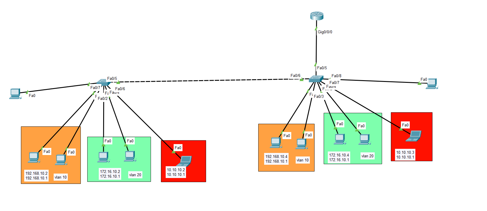

# Router On A Stick

## 🖼️ Network Topology


```markdown
## 📄 Overview
This project establishes Layer 2 network segmentation on a Cisco Catalyst switch.

## 🎯 Project Objective
The objective was to logically segregate network traffic for different departments into isolated broadcast domains, enhancing security and manageability.

## 💡 Skills Demonstrated
- VLAN Configuration
- Port-based VLAN Assignment
- Spanning Tree Protocol (PVST) Configuration

## 🛠️ Core Capabilities
- VLANs (IEEE 802.1Q)
- Spanning Tree Protocol (PVST)

## 📊 Addressing Matrix

| Device / Interface | IP Address | VLAN / Role |
|-------------------|-----------|------------|
| Switch (Fa0/1)    | N/A        | VLAN 10 (HR) |
| Switch (Fa0/2)    | N/A        | VLAN 10 (HR) |
| Switch (Fa0/3)    | N/A        | VLAN 20 (IT) |
| Switch (Fa0/4)    | N/A        | VLAN 20 (IT) |
| Switch (Fa0/6)    | N/A        | VLAN 30 (CEO) |
| Switch (VLAN 1)   | N/A        | Default VLAN |
| Switch (VLAN 10)  | N/A        | HR |
| Switch (VLAN 20)  | N/A        | IT |
| Switch (VLAN 30)  | N/A        | CEO |

## ⚙️ Infrastructure Blueprint

```cisco
hostname Switch
!
spanning-tree mode pvst
spanning-tree extend system-id
!
interface FastEthernet0/1
 switchport access vlan 10
 switchport mode access
!
interface FastEthernet0/2
 switchport access vlan 10
 switchport mode access
!
interface FastEthernet0/3
 switchport access vlan 20
 switchport mode access
!
interface FastEthernet0/4
 switchport access vlan 20
 switchport mode access
!
interface FastEthernet0/6
 switchport access vlan 30
 switchport mode access
!
vlan 10
 name HR
!
vlan 20
 name IT
!
vlan 30
 name CEO
```

## 🧪 Verification Metrics
- Routing table output: N/A - No IP routing configured on this device.
- ICMP ping trace: N/A - No IP connectivity information provided.
```